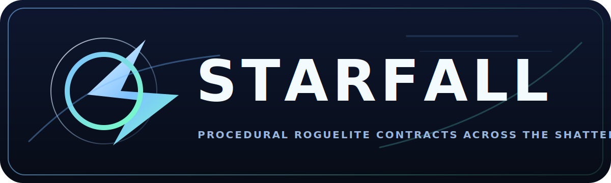

# Starfall

`Starfall` is a top-down sci-fi shooter with roguelite progression. Each run starts with a contract: finish the mission objective, survive the boss fight, and reach extraction if you want to keep a relic Echo for future runs.

Over time you unlock new ships and zones, spend Scrap and Core Shards on permanent upgrades, and build up stronger starting options through the Echo archive.

It is built with plain `HTML`, `CSS`, and `JavaScript` and runs directly in the browser.

## Overview

- Genre: `Top-down sci-fi shooter` / `action roguelite`
- Run flow: `objective -> boss -> extraction -> rewards`
- Long-term progression: `ships`, `zones`, `Foundry upgrades`, `Echo archive`

## Running the Game

Open `index.html` in a browser, or double-click `Play-Starfall.bat`.

## Controls

- `WASD`: move
- `Mouse`: aim
- `Left Mouse`: fire
- `Shift`: dash
- `Q`, `E`, `R`, `F`: class abilities, unlocked through run level milestones
- `T`: deploy a defense tower near the cursor for Scrap
- `C`: toggle auto-fire
- `Esc`: pause

## Core Loop

1. Select a ship frame in The Port.
2. Spend meta-currency on the Foundry talent tree, class unlocks, and zone unlocks.
3. Choose a contract with a mission type, threat tier, mutators, zone, and boss.
4. Fight through the run, collect loot, level up, and draft relics.
5. Use supply pods, prototype weapons, towers, missiles, combo surges, and class abilities to clear the objective and defeat the boss.
6. Extract, collect rewards, archive a relic echo on successful runs, and return to The Port.

## Missions

### `Wreck Sweep`

Recover unstable wreck cores scattered through the map.

- The objective is to physically touch each wreck cache.
- Each cache completion spawns more pressure and pushes the run toward the boss phase.
- Best for mobile frames and loot-routing builds.

### `Hunter-Killer`

Eliminate marked lieutenant enemies until the zone commander appears.

- Elite targets are marked more aggressively than normal enemies.
- The objective is a focused elite hunt before the boss.
- Best for burst damage, sustain, and boss-transition preparation.

### `Reactor Defense`

Hold the drill reactor inside its defense ring until the lock completes.

- The reactor has hull, shield, regeneration, a defense ring, and support turrets.
- Standing inside the ring improves reactor survivability and helps stabilize the phase.
- After the hold finishes, the reactor is secured and the run shifts to the boss kill.

### `Convoy Escort`

Escort an armored convoy through the central freight channel until the surviving freighters reach the far side of the map.

- Each contract rolls a visible allowed-loss percentage for the convoy.
- Enemies can attack both the player and the convoy freighters with contact hits, projectiles, and hazards.
- If convoy losses reach the contract cap, the run fails immediately.
- Best for intercept play, area denial, and durable escort-oriented builds.

## Contracts, Threat, and Mutators

Every contract mixes mission type, zone, threat, and optional mutators.

### Threat

- Threat scales enemy durability, damage, pacing, and rewards.
- Higher threat tiers are intended to feel materially different, not just numerically larger.
- Escort contracts also add a convoy loss-cap constraint on top of the normal threat scaling.

### Mutators

- `Swarm Surge`: larger, more frequent enemy groups
- `Overclocked`: faster enemy movement and fire patterns
- `Shielded`: more enemy shield plating
- `Volatile`: enemies erupt on death
- `Scarcity`: fewer recovery drops but richer payouts
- `Stormfront`: extra bombardment strike zones
- `Hunter Cells`: more elite response squads

## Playable Ships

Each ship has its own manufacturer, frame identity, weapon family, role, and four-slot ability kit.

Ship previews below use the same silhouettes and class colors as the in-game class cards.

### `Vanguard`

- Frame: `VX-11 Bastion`
- Manufacturer: `Argent Yard`
- Role: `Frontline Breacher`
- Signature: shield-breaching assault frame with fortress-grade plating
- Weapon style: balanced rifle burst platform
- Baseline strengths: solid hull, moderate shields, balanced movement, good frontline stability
- Abilities:
- `Q` `Aegis Pulse`: shock pulse, shield restore, missile lash
- `E` `Bulwark Charge`: forward crash and rupture
- `R` `Bastion Barrage`: heavy missile battery
- `F` `Citadel Protocol`: fortress field plus orbital strikes

### `Striker`

- Frame: `SR-7 Raptor`
- Manufacturer: `Halcyon Rushworks`
- Role: `Skirmish Ace`
- Signature: high-response pursuit craft tuned for burst movement and kill chains
- Weapon style: rapid automatic fire
- Baseline strengths: fastest movement, high fire rate, fragile hull, strong crit profile
- Abilities:
- `Q` `Overdrive Step`: dash refresh and tempo spike
- `E` `Afterimage Fan`: forward razor spread
- `R` `Hunter Spiral`: spiraling projectile flood
- `F` `Hyperstorm`: amplified storm state with support fire

### `Warden`

- Frame: `WDN-3 Bulwark`
- Manufacturer: `Anchor Forge`
- Role: `Siege Bulwark`
- Signature: siege chassis that anchors the field with layered fire support
- Weapon style: slow, explosive cannon fire
- Baseline strengths: high hull, strong armor, low mobility, reliable area control
- Abilities:
- `Q` `Bastion Field`: protective burning bulwark
- `E` `Siege Mortar`: target-point bombardment
- `R` `Interceptor Grid`: interceptors and orbital support
- `F` `Cataclysm Core`: siege shockwave detonation

### `Oracle`

- Frame: `ORC-9 Choir`
- Manufacturer: `Lattice Veil`
- Role: `Tech Arcanist`
- Signature: experimental arc vessel that bends the fight with drones and storm logic
- Weapon style: chaining arc fire and tech summons
- Baseline strengths: strong shields, utility, control, and summon synergies
- Abilities:
- `Q` `Drone Swarm`: attack drones and arc surge
- `E` `Arc Prison`: targeted cage field
- `R` `Phase Fracture`: blink and rupture
- `F` `Tempest Choir`: storm field, drones, and chain effects

## Zones

### `Scrap Sea`

- Theme: dead fleets, wreck corridors, ferro-dust storms
- Boss: `Iron Reaper`
- Typical enemies: balanced mix of crawlers, gunners, and raiders
- Common anomaly tendency: mine clusters and pylons

### `Ember Reach`

- Theme: molten canyons, smelter fire, exposed cores
- Boss: `Ember Hydra`
- Typical enemies: heavier raider and mortar presence
- Common anomaly tendency: thermal vents

### `Null Reef`

- Theme: alien wreck growth, bioluminescence, corrupted signal space
- Boss: `Null Matriarch`
- Typical enemies: wasps, sentinels, and siphon units
- Common anomaly tendency: gravity rifts

### `Black Vault`

- Theme: ancient defense complex, cold archive systems, autonomous warforms
- Boss: `Vault Titan`
- Typical enemies: gunners, sentinels, disciplined ranged pressure
- Common anomaly tendency: storm pylons

## Enemy Roster

Enemy portraits below use the same silhouettes and colors as the in-game enemy render set.

### `Scrap Crawler`

- Melee pressure unit
- Wants direct contact and simple pursuit
- Used to clog space and punish inattentive movement

### `Raider Lancer`

- Charger/skirmish melee unit
- Uses burst movement and impact pressure
- Commonly synergizes with boss command buffs

### `Rail Gunner`

- Mid-range ranged unit
- Kites, repositions, and peppers the player with direct fire
- Becomes more dangerous when buffed by command-link style effects

### `Mortar Drone`

- Long-range explosive artillery
- Fires missile-like indirect shots with splash impact
- Excellent at forcing repositioning or pressuring defense objectives

### `Null Wasp`

- Fast skirmisher
- Circles, darts, and saturates space with mobile pressure
- Dangerous in groups or under boss support

### `Sentinel Node`

- Enemy support specialist
- Shields nearby allies and can push command-link buffs onto important targets
- One of the most important enemy types to kill quickly

### `Siphon Wretch`

- Sustain/support controller
- Applies slowing ranged pressure and can feed healing/shield support into elites or bosses
- Long-lived siphons make the whole encounter harder

## Bosses

### `Iron Reaper`

- Fires spread volleys and radial projectile bursts
- Commands raiders and gunners during support windows
- Phase reinforcement emphasizes direct battlefield aggression

### `Ember Hydra`

- Launches explosive missile salvos
- Seeds dangerous burning pools
- Buffs nearby enemies with ember-style aggression and sustain

### `Null Matriarch`

- Teleports, fires slow-inflicting volleys, and uses support shielding
- Benefits heavily from sentinels and wasp support
- Plays like a pressure-and-disruption commander

### `Vault Titan`

- Heavy ranged suppressor
- Uses a rotating beam attack and disciplined support patterns
- Strong synergy with gunner and sentinel adds

## Enemy and Boss Synergy Systems

The current combat model includes explicit cross-unit interactions.

- `Sentinel` units grant shields and push `command-link` style buffs onto priority allies.
- `Siphon` units feed sustain and infusion buffs into elites and bosses.
- Some bosses periodically empower nearby adds instead of fighting completely alone.
- Certain relic set bonuses punish enemy buff webs or amplify your own summon network.

## Level Encounters and Map Events

### Wreck Caches

- Main objective objects in `Wreck Sweep`
- Must be physically secured by the player
- Trigger extra combat pressure

### Hunt Lieutenants

- Marked elite enemies in `Hunter-Killer`
- Must be eliminated before the boss spawns

### Reactor Core

- Main objective in `Reactor Defense`
- Has hull, shields, regeneration, defense ring, and support turrets
- Requires positional defense rather than raw boss-DPS racing

### Armored Convoy

- Main objective in `Convoy Escort`
- Truck-shaped convoy vehicles travel the center corridor either northbound or southbound
- The convoy is protected by player intervention, not by passive immunity
- Enemy contact, projectiles, and hazards can all damage convoy freighters
- Contract failure happens as soon as total convoy loss breaches the allowed percentage

### Supply Pods

Mid-run drops that create tactical tempo swings.

- `Cache Pod`: Scrap, cores, and XP
- `Repair Pod`: hull and shield restoration
- `Overclock Pod`: temporary combat overdrive
- `Magnet Pod`: stronger pickup vacuum field

### Prototype Weapon Caches

Temporary weapon modifiers that do not persist beyond the run.

- `Ion Lance`: piercing ion bolts
- `Swarm Rack`: micro-missile support fire
- `Fracture Cannon`: explosive shard bursts
- `Beam Laser`: projects a piercing beam that cuts through enemies and shoots missiles out of the sky

### Transient Relays

Paired teleporters that only appear on some maps and only stay active for a limited time.

- Both ends are visible while the relay is online
- Stepping into one end teleports the player to the paired exit
- When the relay phase ends, the portals vanish and later return in new random locations
- Intended as a mobility and routing event, not a permanent structure

### Anomalies

Persistent or recurring level hazards and battlefield events.

- `Mine Cluster`: explosive trigger zones
- `Thermal Vent`: damaging vent/pool pressure
- `Gravity Rift`: pull effects and rupture zones
- `Storm Pylon`: radial projectile emitter

### Deployable Defense Towers

- Deployed with `T`
- Cost `Scrap` during the run
- Limited per run
- Snapshot the player weapon, projectile style, and current prototype weapon at placement time
- Have their own health, autonomous targeting, and aggro potential
- Can be destroyed by enemy contact, projectiles, and hazards

### Missiles

- Used by both player and enemy systems
- Have visible rocket bodies and exhaust trails
- Can be shot out of the sky by opposing fire
- Explode on impact or interception

## Pickups and Run Resources

### `XP`

- Used to level up mid-run
- Unlocks relic drafts and the deeper ability kit

### `Scrap`

- Main run currency
- Funds tower deployment during missions
- Converts into hub progression after extraction

### `Core Shards`

- Higher-value progression resource
- Used for unlocks and advanced upgrades in the hub

### `Hull Cells`

- Direct healing pickups

### `Shield Cells`

- Direct shield restoration pickups

## Combo Surge

Kill streaks feed a temporary power state that rewards keeping combat tempo high.

- Three `Combo Surge` tiers can trigger from sustained kill streaks.
- Active surges boost weapon damage, fire rate, move speed, and ability damage.
- High streaks can call in extra supply pods as momentum rewards.
- The Foundry tree includes dedicated combo upgrades for potency, duration, threshold reduction, and shield bursts on surge activation.

## Relics

Relics are draftable run-only power-ups. They stack up to a per-relic limit.

### Common Relics

- `Ferro Core`: weapon damage
- `Thruster Gel`: movement speed and dash quality
- `Capacitor Mesh`: max shield and shield regeneration
- `Reclaimer Nanites`: max health and instant heal
- `Kinetic Feed`: fire rate
- `Recovery Magnet`: pickup radius and Scrap gain
- `Targeting Suite`: crit chance
- `Archive Pulse`: XP gain

### Rare Relics

- `Ember Rounds`: chance to burn enemies
- `Frost Loop`: chance to slow enemies
- `Multitool Array`: additional projectiles
- `Phase Mine`: dash-spawned mines
- `Chain Reactor`: chain lightning
- `Hyper Servo`: pierce and larger projectiles
- `Blood Circuit`: lifesteal
- `Volatile Core`: friendly death explosions
- `Orbital Saw`: orbiting blade unit
- `Echo Drone`: support drone
- `Repair Field`: passive regeneration

### Legendary Relics

- `Warlord Array`: large damage and armor boost
- `Quantum Spindle`: extra projectiles and fire rate
- `Phoenix Core`: one cheat-death trigger
- `Singularity Lens`: stronger ability cooldown scaling and gravity pulse upgrades

## Relic Set Bonuses

These activate automatically when the required relic pair is present.

- `Thermal Shock`: `Ember Rounds` + `Frost Loop`
  Burns plus slows cause enemies to shatter for extra area damage.
- `Escort Wing`: `Echo Drone` + `Orbital Saw`
  Adds extra support units and improves support damage/fire rate.
- `Blood Reserve`: `Blood Circuit` + `Reclaimer Nanites`
  Excess healing converts into shields.
- `Event Horizon`: `Chain Reactor` + `Singularity Lens`
  Abilities create stronger singularity-style follow-up effects and better chain output.

## Permanent Upgrade Tree

The Port foundry is split into four branches and presented on a dedicated `Talent Tree` screen. The hub also shows a `Spec Readout` so current point spread is visible at a glance.

### Weapons Grid

- `Ballistic Forge`: weapon damage
- `Precision Suite`: crit chance
- `Bounty Targeting`: boss damage
- `Finisher Protocol`: stronger `Combo Surge` offensive bonuses

### Hull Matrix

- `Reinforced Hull`: max health
- `Capacitor Bank`: max shield
- `Reactive Plating`: armor

### Thruster Spine

- `Burst Thrusters`: movement speed
- `Actuator Cooling`: dash cooldown
- `Momentum Drive`: longer `Combo Surge` duration and stronger movement payoff

### Command Mesh

- `Archive Decoder`: XP gain
- `Recovery Rigs`: Scrap gain
- `Command Uplink`: class ability cooldown
- `Kill Telemetry`: lower `Combo Surge` thresholds and grant surge shield bursts

## Meta Progression and Campaign Systems

### Foundry Talent Tree

- Permanent upgrades live on their own post-menu `Talent Tree` page.
- Each branch unlocks in sequence, so later nodes open after the previous one is trained.
- The hub displays a compact spec summary instead of the full tree.

### Echo Archive

- Successful runs can preserve one relic into the persistent archive.
- Archived relics automatically appear at the start of later runs.
- Archive capacity is limited, so it becomes a long-term build-planning system.

### Class Unlocks

- `Vanguard` and `Striker` start available.
- `Warden` and `Oracle` require hub investment.

### Zone Unlocks

- New zones unlock progressively through hub spending.

### Achievements

- `Boots On Deck`: first contract
- `Contract Veteran`: 15 completed contracts
- `Scrap Baron`: 5000 lifetime Scrap
- `Boss Hunter`: 20 bosses defeated
- `Threat Breaker`: clear Threat V
- `Horizon Breaker`: reach level 15 in one run
- `Killbox`: 300 kills in one run
- `Combo Engine`: 40 kill streak
- `Perfect Hunt`: flawless boss takedown
- `Full Roster`: unlock all classes
- `Charted Frontier`: unlock all zones
- `Foundry Foreman`: purchase 20 permanent upgrades
- `Fourfold Ace`: win with every class
- `Core Tycoon`: 120 lifetime Core Shards
- `Enduring Light`: survive 25 minutes in one contract

## Options and Presentation

- Procedural music changes between menu, hub, talent screen, missions, and boss fights.
- Audio has `master`, `SFX`, and `music` volume sliders plus a global mute toggle.
- Players can also configure screen shake strength, particle density, and default auto-fire behavior.
- Combat presentation includes damage numbers, hit effects, minimap markers, off-screen objective arrows, and an aim guide line from ship to cursor.

## Combat Utility Systems

- Auto-fire toggle
- Dash i-frames
- Combo Surge streak power states
- DOT/HOT effects through burn, slow, repair, and renewal systems
- Tower deployment economy
- Support drones and orbitals
- Player and enemy missiles
- Boss/add support beams
- Objective overlays and minimap markers
- Damage numbers, particles, afterimages, and screen shake

## Support

If someone wants to support development, the main menu links to [Buy Me a Coffee](https://buymeacoffee.com/whiskeytanj).
